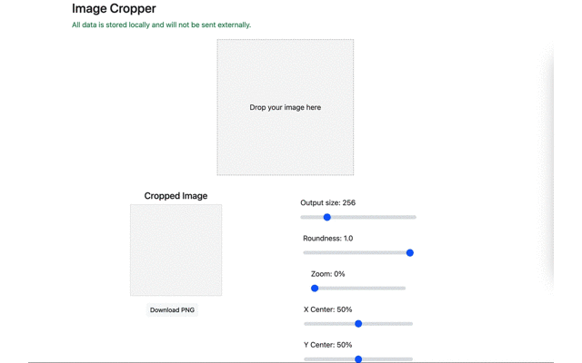

# Image Cropper

  

Image Cropper is a tool that allows you to easily trim images into circular or rounded-corner shapes.

##  Features

Please drag and drop jpeg or png images.  
You can specify the output image parameters using various sliders.

  

## Usage

You can use from here.

https://knziiy.net/image-cropper/

## Author & License

* knziiy
* License:  
  MIT (see LICENSE)
